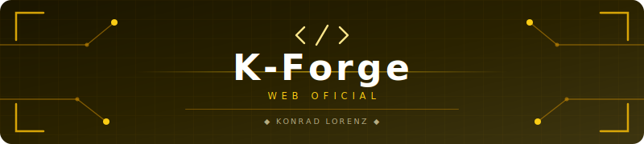

<a id="top"></a>

<div align="center">
  <table style="border: none; background-color: transparent;">
    <tr style="border: none; background-color: transparent;">
      <td align="center" width="20%" style="border: none;">
        <!-- ESPACIO RESERVADO PARA LOGO OFICIAL K-FORGE -->
        
      </td>
      <td align="center" width="80%" style="border: none;">
        <!-- BANNER CIBERNETICO DEL PROYECTO -->
        
      </td>
    </tr>
  </table>
</div>

<p align="center"><strong>Web oficial de K-Forge — club de desarrollo de software de la Fundacion Universitaria Konrad Lorenz.</strong></p>

<p align="center">
  
  
  
  
  
</p>

---

## Tabla de Contenidos

- [Descripcion](#descripcion)
- [Arquitectura de la app web](#arquitectura-de-la-app-web)
- [Stack tecnico](#stack-tecnico)
- [Enlaces rapidos](#enlaces-rapidos)
- [Acceso](#acceso)
- [Licencia](#licencia)

---

## Descripcion

Este repositorio corresponde exclusivamente a la **web oficial de K-Forge** (landing/app institucional).
No representa el codigo de todos los proyectos del club: aqui vive solo la aplicacion web publica desplegada en Vercel.

<p align="center">
  <a href="https://kforge.vercel.app/" target="_blank" rel="noopener noreferrer">
    
  </a>
</p>

### Objetivo del sitio

- Presentar la identidad y propuesta de valor de K-Forge.
- Comunicar mision, enfoque y cultura de colaboracion.
- Mostrar la estructura del equipo y canales de contacto.

### Composicion funcional (secciones actuales)

1. **Inicio (Hero):** presentacion del club y accesos principales.
2. **Nosotros:** mision, que hacemos y por que unirte.
3. **Proyectos:** vitrina de repositorios destacados desde GitHub.
4. **Equipo:** miembros que impulsan el ecosistema K-Forge.
5. **Contacto:** formulario para unirse o colaborar.

### Arquitectura de la app web

- **Framework:** Angular 21 con componentes standalone.
- **Estado local:** Signals (`signal`, `computed`) para UI reactiva.
- **UI y estilos:** Tailwind CSS 3 con tokens del proyecto.
- **Internacionalizacion:** servicio propio con soporte `es` y `en`.
- **Integracion externa:** consumo de GitHub API para datos publicos de repositorios.
- **Deploy:** Vercel (entorno productivo de la landing/app).

### Organizacion del codigo

- `src/app/components/`: secciones visuales standalone de la landing.
- `src/app/services/`: i18n, integraciones y logica reutilizable de aplicacion.
- `src/app/app.ts`: composicion principal de secciones y navegacion.
- `src/styles.css`: estilos globales y base visual compartida.
- `public/`: assets estaticos publicos.

---

## Stack tecnico

**Angular 21** (standalone components + signals) | **Tailwind CSS 3** | **Bun** | **Vercel**

## Entorno local

```bash
# Instalar herramientas (una sola vez)
corepack enable && corepack prepare pnpm@latest --activate
curl -fsSL https://bun.sh/install | bash

# Instalar dependencias
pnpm install

# Ejecutar scripts del proyecto
bun start
bun run build
```

---

## Enlaces rapidos

| Recurso                    | Enlace                                           |
| -------------------------- | ------------------------------------------------ |
| Web oficial (landing page) | [kforge.vercel.app](https://kforge.vercel.app)   |
| Organizacion K-Forge       | [github.com/K-Forge](https://github.com/K-Forge) |
| Contacto                   | kforge.dev@gmail.com                             |

## Acceso

Repositorio publico para consulta y referencia tecnica.

> Mantenimiento exclusivo de miembros autorizados de K-Forge.

## Licencia

<p align="center">
  <a href="LICENSE">
    
  </a>
</p>

Proyecto bajo [Proprietary License](LICENSE) — K-Forge 2026.

El codigo es visible para consulta, pero no se permite su reutilizacion,
modificacion, copia ni distribucion sin autorizacion previa y por escrito de
K-Forge.

---

<div align="center">
  <br>
  <a href="https://github.com/K-Forge">
    
  </a>
  &nbsp;
  <a href="https://kforge.vercel.app">
    
  </a>
  &nbsp;
  <a href="mailto:kforge.dev@gmail.com">
    
  </a>
  <br><br>
  <sub>Forjado por <a href="https://github.com/K-Forge"><strong>K-Forge</strong></a> — Club de desarrollo de la Konrad Lorenz</sub>
  <br><br>
  <a href="#top">
    
  </a>
  <br><br>
  
</div>
